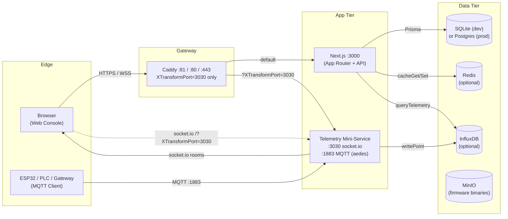
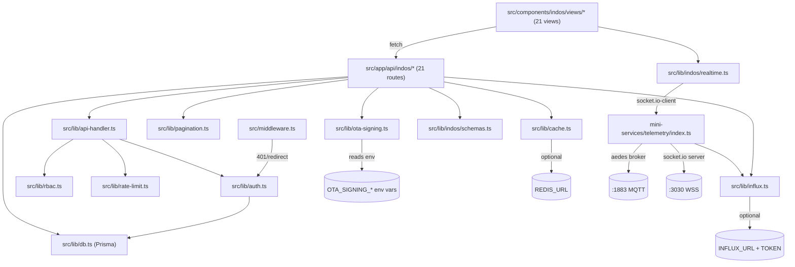
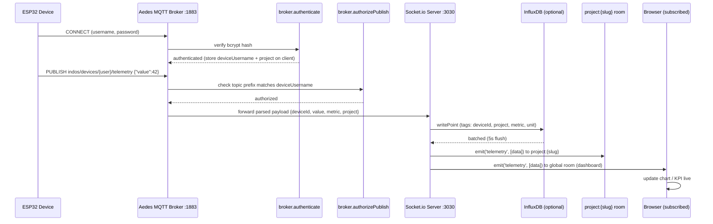
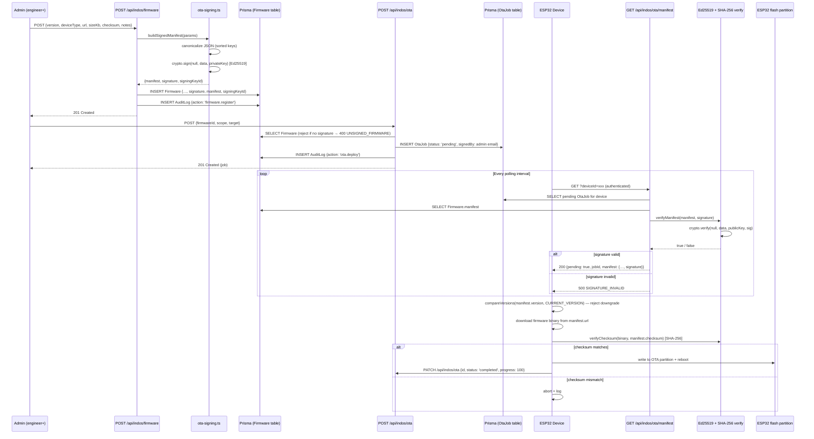

# IndOS — System Architecture

## Overview

IndOS is a self-hosted Industrial IoT OS composed of three runtime tiers: a **Next.js app** (web console + API), a **telemetry mini-service** (MQTT broker + Socket.io server), and a set of **backing services** (Postgres/SQLite, InfluxDB, Redis, Mosquitto, MinIO, Grafana, etc.). The browser never talks to backing services directly — all traffic flows through Caddy, which routes by URL pattern.

## High-Level Topology



**Key rule:** Caddy only forwards `XTransformPort=3030` to the telemetry service. Any other `XTransformPort` value is rejected, which prevents SSRF to internal DB ports (Postgres `:5432`, Redis `:6379`, InfluxDB `:8086`). This was a hardening fix in Phase 10 — the previous `XTransformPort=*` config was an SSRF vector.

## Folder Structure

```
indos/
├── src/
│   ├── app/
│   │   ├── api/
│   │   │   ├── auth/[...nextauth]/route.ts   # NextAuth handler (public)
│   │   │   ├── health/route.ts                # Docker healthcheck (public)
│   │   │   ├── metrics/route.ts               # Prometheus scrape (public)
│   │   │   └── indos/                         # 21 application routes (auth required)
│   │   │       ├── overview/
│   │   │       ├── projects/
│   │   │       ├── devices/
│   │   │       ├── alarms/
│   │   │       ├── workorders/
│   │   │       ├── firmware/
│   │   │       ├── ota/  + ota/manifest/
│   │   │       ├── telemetry/[deviceId]/
│   │   │       ├── gateways/  cameras/  automation/  machines/
│   │   │       ├── topology/  series/  settings/  audit/
│   │   │       ├── users/  orgs/  plugins/  ai/
│   │   ├── login/page.tsx                     # Public login page
│   │   ├── layout.tsx                          # Root layout (SessionProvider)
│   │   ├── page.tsx                            # Main console (auth required)
│   │   └── globals.css
│   ├── components/
│   │   ├── ui/                                 # 47 shadcn/ui primitives
│   │   └── indos/
│   │       ├── shell/                          # sidebar, topbar, command-palette
│   │       ├── shared/                         # charts, status-badge, kpi-card, view-header
│   │       ├── views/                          # 21 view components
│   │       └── providers.tsx                   # SessionProvider + QueryClientProvider
│   ├── lib/
│   │   ├── auth.ts          # NextAuth config (Credentials + bcrypt + JWT)
│   │   ├── rbac.ts          # requireRole, hasRole, requireAnyRole, getRole
│   │   ├── api-handler.ts   # apiHandler(minRole, rateLimit, handler)
│   │   ├── rate-limit.ts    # token bucket, RATE_LIMITS presets
│   │   ├── pagination.ts    # cursor pagination, backward compatible
│   │   ├── ota-signing.ts   # Ed25519 sign/verify, checksum, canonicalize
│   │   ├── influx.ts        # InfluxDB write/query, isInfluxAvailable
│   │   ├── cache.ts         # Redis or in-memory LRU, cached() wrapper
│   │   ├── db.ts            # Prisma client singleton
│   │   ├── api.ts           # withErrorHandler, validateBody
│   │   └── indos/
│   │       ├── schemas.ts   # Zod schemas for all request bodies
│   │       ├── types.ts
│   │       ├── store.ts     # Zustand stores
│   │       └── realtime.ts  # socket.io-client wrapper
│   ├── hooks/
│   └── middleware.ts        # 401 JSON for /api/*, redirect to /login for pages
├── prisma/
│   ├── schema.prisma        # 29 models
│   └── seed.ts              # Demo data (5 users, 8 projects, ~60 devices, …)
├── mini-services/
│   └── telemetry/
│       ├── index.ts         # Aedes broker :1883 + Socket.io :3030
│       ├── devices.json     # bcrypt-hashed device credentials
│       └── package.json
├── scripts/
│   ├── generate-ota-keys.ts # Ed25519 key pair generator
│   └── provision-device.sh  # Add a device to devices.json
├── tests/
│   └── e2e/indos.spec.ts    # 14 Playwright tests
├── docs/                     # This directory
├── Dockerfile                # 3-stage: deps → build → runner (non-root)
├── docker-compose.yml        # 16 services (app, DBs, broker, observability)
├── Caddyfile                 # Reverse proxy + SSRF guard
├── mosquitto.conf            # Production Mosquitto config (auth required)
├── mosquitto-acl.conf        # Per-device ACL pattern
├── playwright.config.ts
├── vitest.config.ts
└── .github/workflows/ci.yml  # lint, typecheck, build, audit
```

## Module Dependencies



**Dependency rules enforced across phases:**
- Views never import `prisma` or `db` directly — they go through API routes.
- `src/lib/auth.ts` is the single source of truth for NextAuth config; `apiHandler` consumes it.
- OTA private key is read from env at sign time — never imported by any client module.
- The telemetry mini-service is a standalone Bun process with its own `package.json` and `bun.lock` — it shares types with the app but has no runtime dependency on it.

## Data Flow: Telemetry (MQTT → Browser)



**Key invariants:**
- A device can only publish to `indos/devices/{its-own-username}/telemetry|heartbeat|status` — ACL rejects anything else.
- A device can only subscribe to `indos/devices/{its-own-username}/cmd|config|ota` — command topics are scoped.
- Telemetry is fanned out to **two** socket rooms: `project:{slug}` (for users viewing that project) and `global` (for the dashboard overview). Users who haven't subscribed to a project only get the global stream.
- The InfluxDB write is non-blocking — if it fails, the live stream still works.
- If InfluxDB is not configured (`INFLUX_URL`/`INFLUX_TOKEN` unset), telemetry is live-only; historical queries fall back to SQLite (`Telemetry` table, last 240 points per device).

## Data Flow: OTA Firmware Update



**Security invariants:**
- The Ed25519 **private key** lives only in `OTA_SIGNING_PRIVATE_KEY` (env) — never sent to the client, never in the bundle.
- The **public key** (`OTA_SIGNING_PUBLIC_KEY`) is safe to embed in ESP32 firmware for verification.
- `POST /api/indos/ota` rejects firmware with no signature/manifest with **400 UNSIGNED_FIRMWARE**.
- The manifest endpoint re-verifies the signature server-side before returning it to the device — defense in depth.
- **Downgrade protection** is the device's responsibility: the ESP32 sketch must compare `manifest.version` against its current firmware version and reject older versions.
- The signing key id (`OTA_SIGNING_KEY_ID`, default `key-001`) is stored in the manifest so devices can support key rotation — a device can refuse a manifest signed by an unknown key id.

## Telemetry Mini-Service Ports

| Port | Protocol | Purpose | Auth |
|------|----------|---------|------|
| `:3030` | HTTP + Socket.io | Browser realtime (telemetry, alarms, device vitals, system metrics) | None (rooms are project-scoped; sensitive data not exposed) |
| `:1883` | MQTT | Physical device publish/subscribe | **Required** — bcrypt username/password + per-device ACL |

The mini-service is a standalone Bun project (`mini-services/telemetry/package.json`) with its own `bun.lock`. It loads device credentials from `mini-services/telemetry/devices.json` (auto-created on first run with a default `esp32-sensor-01` device). In production, this would be backed by the database; for now it's a JSON file updated by `scripts/provision-device.sh`.

## Backing Services (docker-compose)

The production `docker-compose.yml` defines 16 services across two networks:

- **`internal`** (bridge, not exposed): Postgres, Redis, InfluxDB, MinIO, Prometheus, Grafana, Loki, Alertmanager, Node-RED, Keycloak, Ollama, Qdrant, backup
- **`edge`** (bridge, exposed): `indos` app (`:3000`), Caddy (`:80`/`:443`), Mosquitto (`:1883`), Keycloak (admin UI)

Only `indos`, Caddy, and Mosquitto have host ports. Everything else is reachable only from inside the `internal` network — Postgres on `:5432`, Redis on `:6379`, InfluxDB on `:8086` are never exposed to the host or the browser.

## Process Lifecycle

| Process | Start command | Restarts |
|---------|---------------|----------|
| Next.js dev | `bun run dev` | on file change (Next.js HMR) |
| Telemetry service | `cd mini-services/telemetry && bun run dev` | `bun --hot` on file change |
| Production app | `bun .next/standalone/server.js` (in Docker) | Docker `restart: unless-stopped` |
| Healthcheck | `fetch('/api/health')` every 30s | Docker retries 3, start period 15s |

## Observability

| Signal | Source | Consumer |
|--------|--------|----------|
| Liveness | `GET /api/health` → `{ok, checks:{db}}` | Docker, K8s, load balancer |
| Metrics | `GET /api/metrics` → uptime, memory, device counts, alarm counts, OTA jobs, infra status | Prometheus (scrape), Grafana (dashboard) |
| Logs | `console.log` / `console.warn` in app + telemetry service | Loki (via Promtail or Docker logging driver) |
| Audit trail | `AuditLog` table (login, firmware.register, ota.deploy, plugin.install, alarm.ack, workorder.create) | `GET /api/indos/audit` (admin only) |
| Realtime health | `io.to('global').emit('system-metrics', …)` every 4.5s | Browser dashboard (LIVE indicator) |

## Design Principles

1. **Local-first** — every component can run on a single box with no external cloud dependency. InfluxDB, Redis, Keycloak, Ollama, Qdrant are all optional.
2. **Graceful degradation** — if InfluxDB is down, telemetry streams live and queries fall back to SQLite. If Redis is down, caching falls back to in-memory LRU. The platform never hard-fails on a missing optional service.
3. **Backward compatibility** — pagination returns a flat array by default; `?paginated=true` opts into cursor mode. Existing views didn't need changes when pagination was added.
4. **Defense in depth** — middleware (401) → apiHandler RBAC (403) → rate limit (429) → handler logic → audit log. Each layer is independently testable.
5. **No secrets in the client bundle** — `NEXT_PUBLIC_*` is never used for secrets; the OTA private key, NextAuth secret, DB password, and InfluxDB token stay server-side.
