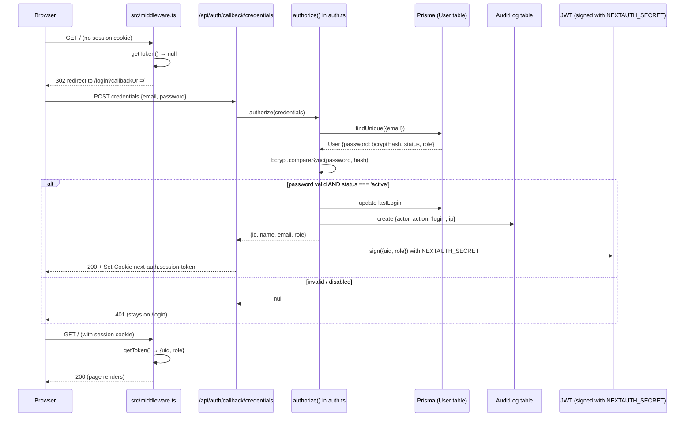
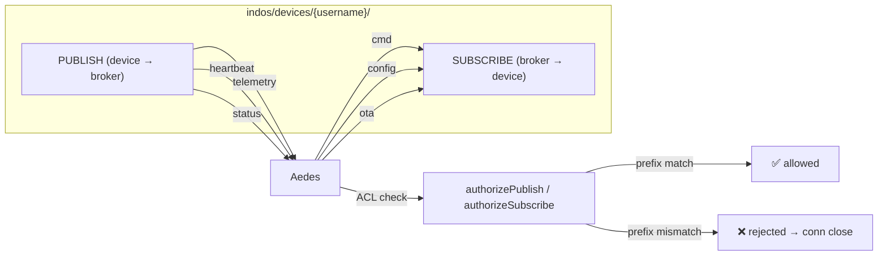
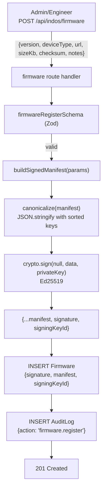
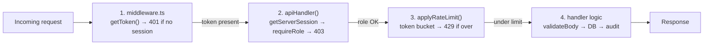

# IndOS — Security Model

> **Grade: A-** — Production-ready for single-tenant / single-instance deployments. See "Remaining Gaps" for the P0 items blocking multi-tenant SaaS.

## 1. Authentication Flow

IndOS uses **NextAuth.js v4** with the **Credentials provider** and **JWT sessions**. There is no external Identity Provider in the default deployment (Keycloak OIDC is a P2 roadmap item).



### Password storage
- Hashed with **bcrypt** at 10 rounds (`bcrypt.hashSync(password, 10)`).
- Stored in `User.password` (nullable for future OIDC-only users).
- Verified with `bcrypt.compareSync(password, user.password)` — constant-time comparison.
- The plaintext password is **never logged** and never persisted.

### Session
- Strategy: **JWT** (stateless, no session table).
- Token signed with `NEXTAUTH_SECRET` (env, generate with `openssl rand -base64 32`).
- Token payload: `{uid, role, email, name, exp, iat, jti}`.
- The `role` is added to the token in the `jwt` callback and propagated to `session.user.role` in the `session` callback — so RBAC checks on the server can read `session.user.role` without an extra DB lookup.

### Login audit
Every successful login writes an `AuditLog` row: `{actor: user.email, action: 'login', ip: '0.0.0.0'}`. (The IP is a placeholder — extracting the real client IP from `x-forwarded-for` is a P2 improvement.)

## 2. RBAC Matrix

Four roles with a strict hierarchy: **admin (4) > engineer (3) > operator (2) > viewer (1)**. The hierarchy is enforced by `requireRole(session, minRole)` in `src/lib/rbac.ts` — a role grants all permissions of lower roles.

### Role → route permission matrix

| Route | Method | admin | engineer | operator | viewer |
|-------|--------|:-----:|:--------:|:--------:|:------:|
| `/api/indos/overview` | GET | ✅ | ✅ | ✅ | ✅ |
| `/api/indos/projects` | GET | ✅ | ✅ | ✅ | ✅ |
| `/api/indos/projects` | POST | ✅ | ✅ | ❌ | ❌ |
| `/api/indos/devices` | GET | ✅ | ✅ | ✅ | ✅ |
| `/api/indos/alarms` | GET | ✅ | ✅ | ✅ | ✅ |
| `/api/indos/alarms` | PATCH (ack) | ✅ | ✅ | ✅ | ❌ |
| `/api/indos/alarms` | PATCH (resolve) | ✅ | ✅ | ❌ | ❌ |
| `/api/indos/workorders` | GET | ✅ | ✅ | ✅ | ✅ |
| `/api/indos/workorders` | POST | ✅ | ✅ | ✅ | ❌ |
| `/api/indos/workorders` | PATCH | ✅ | ✅ | ✅ | ❌ |
| `/api/indos/gateways` | GET | ✅ | ✅ | ✅ | ✅ |
| `/api/indos/cameras` | GET | ✅ | ✅ | ✅ | ✅ |
| `/api/indos/automation` | GET | ✅ | ✅ | ✅ | ✅ |
| `/api/indos/machines` | GET | ✅ | ✅ | ✅ | ✅ |
| `/api/indos/topology` | GET | ✅ | ✅ | ✅ | ✅ |
| `/api/indos/series` | GET | ✅ | ✅ | ✅ | ✅ |
| `/api/indos/settings` | GET | ✅ | ✅ | ✅ | ✅ |
| `/api/indos/orgs` | GET | ✅ | ✅ | ✅ | ✅ |
| `/api/indos/plugins` | GET | ✅ | ✅ | ✅ | ✅ |
| `/api/indos/plugins` | POST (install/enable/disable/uninstall) | ✅ | ✅ | ❌ | ❌ |
| `/api/indos/firmware` | GET | ✅ | ✅ | ✅ | ✅ |
| `/api/indos/firmware` | POST (register + sign) | ✅ | ✅ | ❌ | ❌ |
| `/api/indos/ota` | GET | ✅ | ✅ | ✅ | ✅ |
| `/api/indos/ota` | POST (deploy) | ✅ | ✅ | ❌ | ❌ |
| `/api/indos/ota` | PATCH (status) | ✅ | ✅ | ❌ | ❌ |
| `/api/indos/ota/manifest` | GET (device-facing) | ✅ | ✅ | ✅ | ✅ (any authenticated) |
| `/api/indos/telemetry/[deviceId]` | GET | ✅ | ✅ | ✅ | ✅ (any authenticated) |
| `/api/indos/ai` | POST | ✅ | ✅ | ✅ | ✅ |
| `/api/indos/users` | GET | ✅ | ❌ | ❌ | ❌ |
| `/api/indos/audit` | GET | ✅ | ❌ | ❌ | ❌ |

### Special-case: alarm resolution
`PATCH /api/indos/alarms` requires `operator+` to acknowledge but `engineer+` to resolve. The route handler does an in-handler role check after `apiHandler('operator', …)` passes:

```ts
if (state === 'resolved') {
  const role = (session.user as any)?.role
  if (role !== 'admin' && role !== 'engineer') {
    return NextResponse.json({ error: 'FORBIDDEN', ... }, { status: 403 })
  }
}
```

### How enforcement works

Every protected route is wrapped in `apiHandler(minRole, rateLimit, handler)`:

```ts
export const POST = withErrorHandler(apiHandler('engineer', RATE_LIMITS.write, async (req, session) => {
  // session is guaranteed non-null, role is verified
}))
```

The `apiHandler` runs three checks in order:
1. `getServerSession(authOptions)` — if null, returns **401**.
2. `requireRole(session, minRole)` — if insufficient, returns **403**.
3. `applyRateLimit(rateKey, rateLimit)` — if over budget, returns **429**.

Only if all three pass does the handler run.

## 3. MQTT Security

The MQTT broker (Aedes, in the telemetry mini-service) enforces three layers:

### 3.1 Authentication (`broker.authenticate`)
- Devices must send a username and password in the MQTT CONNECT packet.
- The password is verified against a bcrypt hash stored in `mini-services/telemetry/devices.json`.
- On success, `client.deviceUsername` and `client.deviceProject` are stored on the connection for ACL checks.
- The internal `indos-bridge` account (password from `BRIDGE_PASSWORD` env) bypasses device lookup — it can subscribe to all topics for forwarding to other systems.

### 3.2 Publish ACL (`broker.authorizePublish`)
Devices can **publish** only to topics matching their own username:

| Allowed publish topic | Purpose |
|----------------------|---------|
| `indos/devices/{username}/telemetry` | Real-time sensor readings |
| `indos/devices/{username}/telemetry/<metric>` | Per-metric subtopics |
| `indos/devices/{username}/heartbeat` | Liveness signal |
| `indos/devices/{username}/status` | Online/offline/fault state |

Any other topic → `callback(new Error('Topic not authorized'))` → connection is closed.

### 3.3 Subscribe ACL (`broker.authorizeSubscribe`)
Devices can **subscribe** only to their own command topics:

| Allowed subscribe topic | Purpose |
|------------------------|---------|
| `indos/devices/{username}/cmd` | Downstream commands |
| `indos/devices/{username}/config` | Configuration pushes |
| `indos/devices/{username}/ota` | OTA manifest notifications |
| `indos/devices/{username}/#` | Wildcard (own namespace only) |

A device cannot subscribe to another device's topics — this prevents lateral movement if one device is compromised.

### Topic namespace diagram



### Device provisioning
New devices are added via `scripts/provision-device.sh <device-id> <password>`:
1. Generates a bcrypt hash of the password.
2. Appends (or updates) the entry in `mini-services/telemetry/devices.json`.
3. Prints the ESP32 config (`MQTT_USER`, `MQTT_PASSWORD`) to paste into the sketch.

In production this should be backed by the database (P1 roadmap item).

## 4. OTA Signing Workflow

OTA firmware updates use **Ed25519** for manifest signing and **SHA-256** for binary integrity.

### 4.1 Key pair generation

```bash
bun run scripts/generate-ota-keys.ts
```

Outputs three values to add to `.env`:
- `OTA_SIGNING_PRIVATE_KEY` (base64 PKCS#8 DER) — **NEVER expose to client**
- `OTA_SIGNING_PUBLIC_KEY` (base64 SPKI DER) — safe to embed in ESP32 firmware
- `OTA_SIGNING_KEY_ID` (default `key-001`) — identifier stored in manifest for key rotation

### 4.2 Signing flow



### 4.3 Deployment flow

`POST /api/indos/ota` creates an `OtaJob` pointing at a signed `Firmware`. The route **rejects unsigned firmware with 400 `UNSIGNED_FIRMWARE`**:

```ts
if (!firmware.signature || !firmware.manifest) {
  return NextResponse.json({ error: 'UNSIGNED_FIRMWARE', ... }, { status: 400 })
}
```

### 4.4 Device-side verification

The device fetches its manifest via `GET /api/indos/ota/manifest?deviceId=xxx`. The server **re-verifies the signature** before returning the manifest (defense in depth):

```ts
const valid = verifyManifest(manifest, signedManifest.signature)
if (!valid) return NextResponse.json({ error: 'SIGNATURE_INVALID', ... }, { status: 500 })
```

On the device (ESP32 sketch), the verification sequence is:
1. Parse the manifest JSON.
2. Compare `manifest.version` against the device's current firmware version — **reject if older** (downgrade protection).
3. Look up the public key by `manifest.signingKeyId` — **reject if unknown** (key rotation support).
4. Verify the Ed25519 signature using the embedded public key.
5. Download the firmware binary from `manifest.url`.
6. Compute SHA-256 of the downloaded bytes and compare to `manifest.checksum` (`sha256:hex…`).
7. Only if all checks pass: write to the OTA partition and reboot.

### 4.5 Canonicalization

Manifests are canonicalized before signing to ensure deterministic verification across languages (Node.js signs, ESP32 verifies in C):

```ts
export function canonicalize(manifest: OtaManifest): string {
  return JSON.stringify(manifest, Object.keys(manifest).sort())
}
```

This produces a JSON string with keys in alphabetical order and no extra whitespace — the same bytes on both sides.

## 5. API Security

### 5.1 Three-layer defense



| Layer | Failure mode | Status code |
|-------|--------------|-------------|
| Middleware (unauth) | No session cookie | **401** `{error: 'UNAUTHORIZED'}` |
| apiHandler (no session) | Session missing (defense in depth) | **401** |
| apiHandler (wrong role) | `requireRole` fails | **403** `{error: 'FORBIDDEN'}` |
| Rate limit | Token bucket empty | **429** `{error: 'RATE_LIMITED'}` + headers |
| Schema validation | Zod parse fails | **422** `{error: 'VALIDATION_ERROR'}` |
| Handler logic | Not found / conflict | **404** / **400** |

### 5.2 Rate limits

In-memory token bucket keyed by `${session.user.email}:${routePath}`. Refilled continuously (not fixed window).

| Preset | Limit | Window | Routes |
|--------|-------|--------|--------|
| `RATE_LIMITS.ai` | 5 | 1 min | `POST /api/indos/ai` |
| `RATE_LIMITS.ota` | 10 | 1 min | `POST /api/indos/ota` |
| `RATE_LIMITS.firmware` | 10 | 1 min | `POST /api/indos/firmware` |
| `RATE_LIMITS.write` | 30 | 1 min | All other POST/PATCH |
| `RATE_LIMITS.read` | 120 | 1 min | All GET |

When blocked, the response includes:
```
X-RateLimit-Limit: 5
X-RateLimit-Remaining: 0
X-RateLimit-Reset: 1720080000
Retry-After: 47
```

**Caveat:** In-memory only — multi-instance deployments need a Redis-backed counter (P0 roadmap).

## 6. CORS & CSP Headers

### Caddy gateway hardening

The `Caddyfile` is the only externally exposed reverse proxy. It restricts the `XTransformPort` query parameter to `3030` (the telemetry service) only:

```caddy
:81 {
    @telemetry_port {
        query XTransformPort=3030
    }
    handle @telemetry_port {
        reverse_proxy localhost:3030 { ... }
    }
    handle {
        reverse_proxy localhost:3000 { ... }
    }
}
```

This closes the SSRF vector that would have allowed `?XTransformPort=5432` to reach Postgres, `?XTransformPort=6379` to reach Redis, etc.

### Next.js security headers (recommended for production)

Add to `next.config.ts` (or via Caddy) before multi-region rollout:

| Header | Value | Purpose |
|--------|-------|---------|
| `X-Content-Type-Options` | `nosniff` | Prevent MIME sniffing |
| `X-Frame-Options` | `DENY` | Prevent clickjacking (or `SAMEORIGIN` if embedding) |
| `Referrer-Policy` | `strict-origin-when-cross-origin` | Limit referrer leakage |
| `Permissions-Policy` | `camera=(), microphone=(), geolocation=()` | Disable unused browser features |
| `Strict-Transport-Security` | `max-age=31536000; includeSubDomains` | Force HTTPS |
| `Content-Security-Policy` | `default-src 'self'; script-src 'self' 'unsafe-inline'; ...` | Mitigate XSS (tune for Next.js inline styles) |

These are **not yet set** in the codebase — they're a P2 hardening item. The middleware currently only handles auth, not headers.

## 7. Public vs Protected Routes

| Path pattern | Auth | Reason |
|--------------|------|--------|
| `/login` | ❌ Public | Users need to log in |
| `/api/auth/*` (NextAuth: csrf, session, signin, callback) | ❌ Public | NextAuth internals |
| `/api/health` | ❌ Public | Docker/K8s liveness probe — must work without auth |
| `/api/metrics` | ❌ Public | Prometheus scrape — must work without auth; exposes only aggregate counts |
| `/_next/static/*`, `/_next/image/*`, `favicon.ico`, `indos-logo.svg` | ❌ Public | Static assets |
| `/` and all other pages | ✅ Redirect to `/login` | Authenticated console |
| `/api/indos/*` (21 routes) | ✅ **401** JSON | All application APIs require a session |
| `/api/` (root, hello world) | ❌ Public | Trivial placeholder — remove in production |

The matcher in `src/middleware.ts`:

```ts
export const config = {
  matcher: [
    '/((?!login|api/auth|api/health|api/metrics|_next/static|_next/image|favicon.ico|indos-logo.svg).*)',
  ],
}
```

## 8. Secrets Management

| Secret | Location | Rotation |
|--------|----------|----------|
| `NEXTAUTH_SECRET` | `.env` on host / K8s secret / Docker secret | Rotate by setting new value + forcing re-login (all sessions invalidated) |
| `OTA_SIGNING_PRIVATE_KEY` | `.env` — **never** in client bundle | Rotate by generating new key pair, updating `OTA_SIGNING_KEY_ID`, embedding new public key in next firmware release; old manifests still verify with old key id |
| `OTA_SIGNING_PUBLIC_KEY` | `.env` + embedded in ESP32 firmware | Bumped with each firmware release that needs to verify new signatures |
| `DATABASE_URL` (with password) | `.env` | Rotate Postgres password + update connection string |
| `INFLUX_TOKEN` | `.env` | Rotate via InfluxDB admin UI |
| `REDIS_URL` (with password) | `.env` (optional) | Rotate via Redis config |
| `BRIDGE_PASSWORD` | `.env` (optional) | Rotate + update bridge clients |
| `DB_PASSWORD`, `INFLUX_PASSWORD`, `MINIO_PASSWORD`, `GRAFANA_PASSWORD`, `KC_PASSWORD` | `.env` (docker-compose) | Rotate via each service's admin UI |

**Hard rules:**
- `.env` is gitignored and never committed.
- `NEXT_PUBLIC_*` env vars are never used for secrets — anything prefixed `NEXT_PUBLIC_` is inlined into the client bundle.
- The OTA private key is read from env at sign time in `src/lib/ota-signing.ts` — no client module imports it.
- Error messages never include secrets: `Error('OTA_SIGNING_PRIVATE_KEY env var not set')` is safe; `Error('key was: MC4C...')` would not be.

## 9. Security Headers Table (current state)

| Header | Set by | Status |
|--------|--------|--------|
| `X-RateLimit-Limit` | `applyRateLimit()` on 429 | ✅ Phase 8 |
| `X-RateLimit-Remaining` | `applyRateLimit()` on 429 | ✅ Phase 8 |
| `X-RateLimit-Reset` | `applyRateLimit()` on 429 | ✅ Phase 8 |
| `Retry-After` | `applyRateLimit()` on 429 | ✅ Phase 8 |
| `X-Content-Type-Options` | (not set) | ⚠️ P2 |
| `X-Frame-Options` | (not set) | ⚠️ P2 |
| `Referrer-Policy` | (not set) | ⚠️ P2 |
| `Permissions-Policy` | (not set) | ⚠️ P2 |
| `Strict-Transport-Security` | (not set; Caddy handles TLS) | ⚠️ P2 |
| `Content-Security-Policy` | (not set) | ⚠️ P2 (needs tuning for Next.js inline styles) |

## 10. Remaining Gaps

| # | Gap | Severity | Mitigation plan | Roadmap |
|---|-----|----------|-----------------|---------|
| 1 | **Per-tenant `orgId` scoping not enforced** — all users see all orgs' data | High | Add `orgId` to JWT; filter all list queries by `session.user.orgId`; add org-scoped MQTT topics | P0 |
| 2 | **Rate limiter is in-memory** — doesn't share state across instances | Medium | Switch to Redis-backed counter (`@upstash/ratelimit` or custom Lua script) | P0 |
| 3 | **No mTLS on MQTT** — username/password only, traffic is plaintext | Medium | Add `--cafile`/`--cert`/`--key` to aedes; provision device certs | P3 |
| 4 | **No Keycloak/OIDC** — local accounts only | Low | Add NextAuth OIDC provider pointing at bundled Keycloak | P2 |
| 5 | **Security headers not set** — `X-Content-Type-Options`, CSP, etc. | Low | Add `headers()` to `next.config.ts` or Caddy | P2 |
| 6 | **Audit log IP is placeholder `0.0.0.0`** — doesn't capture real client IP | Low | Read `x-forwarded-for` in authorize() and route handlers | P2 |
| 7 | **No account lockout** — brute force possible (rate limit mitigates, not blocks) | Low | Add exponential backoff + lockout after N failed attempts | P2 |
| 8 | **No 2FA enforcement** — `User.twoFA` flag exists but no TOTP flow | Low | Add `otplib` + QR code enrollment; require for admin role | P2 |
| 9 | **CI `bun audit \|\| true`** — non-blocking | Low | Remove `\|\| true`; establish vulnerability baseline | P2 |
| 10 | **No industrial certifications** (IEC 62443, ISO 27001) | Low | Pursue certifications after P0/P1 items resolved | P3 |
